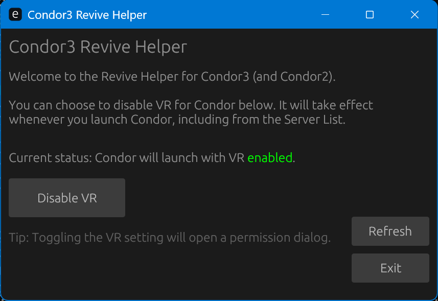

# Condor 3 Revive Helper

A lightweight utility for Condor 3, to enable VR support via Revive more easily. When enabled, any launch of Condor - whether by the normal shortcut, or via the Server List - will be routed via the ReviveInjector to ensure it works in VR. 



> [!tip]
> This program also supports Condor 2, and it works with the latest Revive in addition to older versions. 

## Getting Started

### Installation
1. Download the latest Condor3ReviveHelper_Setup.exe from the Releases page.
2. Run the installer and follow the on-screen instructions.
3. A shortcut will be created on your Desktop and in your Start Menu.

### How to Use
1. Launch the Condor3 Revive Helper application.
2. Click the Enable VR button.

Then, whenever you want to run Condor, just launch it as you normally would. The helper will automatically intercept the launch and initialize VR support.

To go back to standard mode, simply open the helper again and click Disable VR.

---

## Building from Source

If you want to build the project yourself, follow these steps:

### Prerequisites
* Rust: Install via rustup.rs.
* Inno Setup (Optional): Required if you want to generate the .exe installer. Download it from jrsoftware.org.

### 1. Compile the Binaries
Run the following command in the project root to build the optimized release binaries:

```powershell
cargo build --release
```

The compiled files will be located in target/release/:
* gui.exe (Main configuration interface)
* CondorVR.exe (The VR launcher/interceptor)
* Condor-VR-Configurer.exe (The registry configuration utility)

### 2. Create the Installer (Optional)
If you have Inno Setup installed and iscc is in your system PATH, run:

```powershell
iscc installer.iss
```

The installer will be generated in the Output directory.
