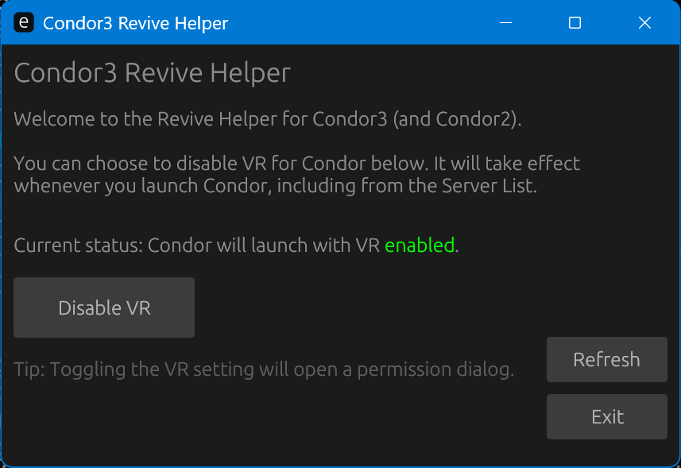

# Condor 3 Revive Helper

A lightweight utility for Condor 3, to enable/disable VR support via Revive more easily. When enabled, **any launch** of Condor - whether by the normal shortcut, or via the Server List - will be routed via the ReviveInjector to ensure it works in VR. 



> [!tip]
> This program also supports Condor 2. It requires [Revive](https://github.com/LibreVR/Revive) `v3.2.0`, which is the latest version as of 2026. 

## Getting started

### Installation

1. Download the latest `Condor3ReviveHelper_Setup.exe` from the [Releases](https://github.com/TheGreatCabbage/condor3-revive-helper/releases) page.
    - In some browsers, like Edge, you may get severe warnings. This is because the program is new and because it's too expensive to get a signing certificate. There's always an option to continue anyway, although it may not be obvious. 
2. Run the installer and follow the on-screen instructions.
    - If you get a big blue smartscreen dialog, you can click "More info" and then "Run anyway". As above, this may occur because signing certificates are too expensive. 
    - **Important**: If you get an error referring to `VCRUNTIME140.dll` at this point, or when trying to launch the program, install the VC redistributables from the [official Microsoft site](https://learn.microsoft.com/en-us/cpp/windows/latest-supported-vc-redist?view=msvc-170#latest-supported-redistributable-version).
4. A shortcut for Condor3 Revive Helper will be created on your Desktop and in your Start Menu, which allows you to open the window shown above.

### How to Use

VR is enabled automatically during installation, unless unchecked. Whenever you want to run Condor, just launch it as you normally would. The helper will automatically intercept the launch and initialize VR support via Revive.

If you ever need to toggle VR support:
1. Launch the Condor3 Revive Helper application.
2. Click the Disable VR (or Enable VR) button.

---

## Building from source

If you want to build the project yourself, follow these steps:

### Prerequisites
* Rust: Install via `rustup.rs`.
* Inno Setup (Optional): Required if you want to generate the `.exe` installer. Download it from `jrsoftware.org`.

### 1. Compile the binaries
Run the following command in the project root to build the optimized release binaries:

```powershell
cargo build --profile opt
```

Then the main program can be launched from `target/opt/gui.exe`. 

### 2. Create the installer (optional)
If you have Inno Setup installed and iscc is in your system PATH, run:

```powershell
iscc installer.iss
```

The installer will be generated in the `Output` directory.
